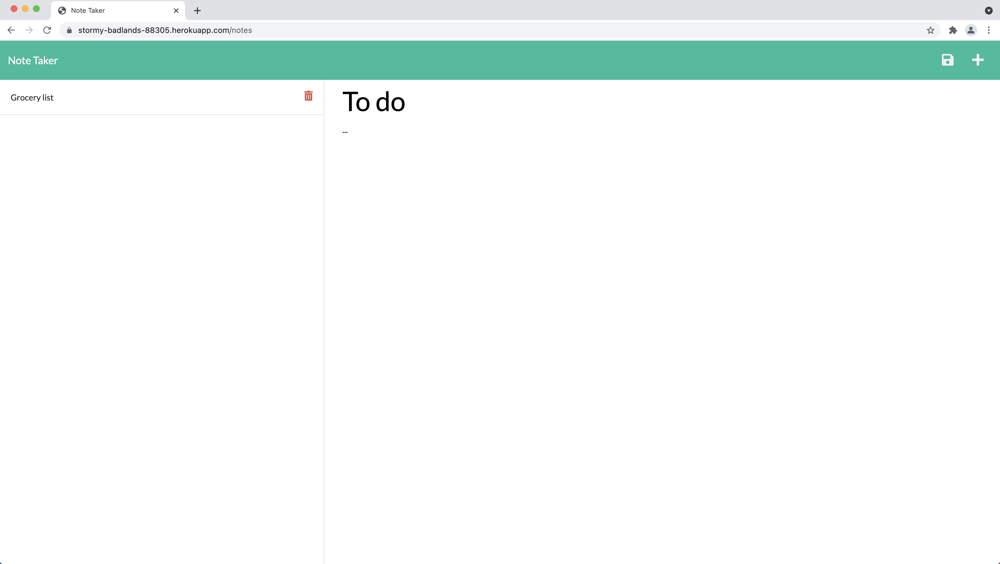

# Note Taker

## Table of Contents
  
1. [Description](#description)
2. [Installation](#installation)
3. [Usage](#usage)
4. [License](#license)
5. [Contributing Guidelines](#contributing-gåuidelines)
6. [Test Instructions](#test-instructions)
7. [Questions](#questions)
  
## Description

* Create an application called Note Taker that can be used to write and save notes. This application will use an Express.js back end and will save and retrieve note data from a JSON file.
  
## Installation

* Clone the repository, install npm using npm init -y, then install express using npm install inquirer.

## Usage

## License
  
* MIT
  
## Contributing Guidelines

* Fork the repository, commit contributions, then create a pull request.

## Test Instructions

* Fork the repository, create tests, then submit an issue. 
  
## Questions

Contact information for questions:

* Email: 04-scones.card@newengood.com
* Github: https://github.com/newengood
  
  
